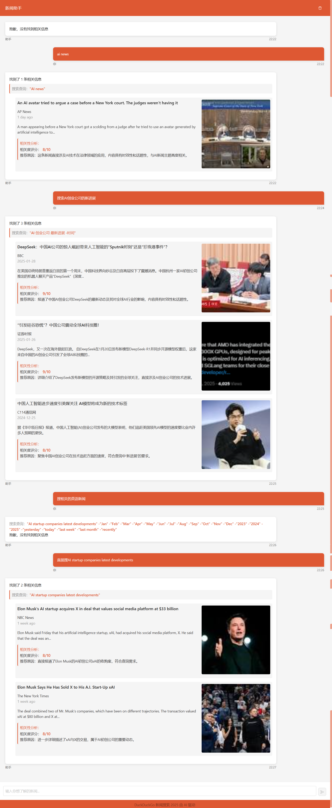

# News Search Agent

This is an intelligent application that uses DuckDuckGo or Google to search for news, with a React frontend and Python backend. The application flow is as follows:

1. User inputs a search topic
2. AI generates optimized search queries
3. The system uses DuckDuckGo or Google to search for relevant news
4. AI analyzes search results and returns the most relevant content
5. If no relevant results are found, the system prompts the user to narrow down the search and provides suggestions

## Multi-turn Conversation Screenshot



## Project Structure

```
savor/
├── backend/             # Python backend
│   ├── app.py           # FastAPI application main file
│   ├── requirements.txt # Dependencies
│   └── .env.example     # Environment variables example file
└── frontend/            # React frontend
    ├── src/             # Source code
    ├── public/          # Static resources
    └── package.json     # Dependency configuration
```

## Installation and Running

### Backend Setup

1. Navigate to the backend directory:
   ```
   cd backend
   ```

2. Create and activate a virtual environment (optional but recommended):
   ```
   python -m venv venv
   # Windows
   venv\Scripts\activate
   # Linux/Mac
   source venv/bin/activate
   ```

3. Install dependencies:
   ```
   pip install -r requirements.txt
   ```

4. Create environment variables file:
   ```
   # Copy example file
   copy .env.example .env
   # Edit the .env file, add your OpenAI API key, DeepSeek API key, SERPAPI API key, and search engine selection
   ```

5. Run the backend service:
   ```
   python app.py
   ```

### Frontend Setup

1. Navigate to the frontend directory:
   ```
   cd frontend
   ```

2. Install dependencies:
   ```
   yarn
   ```

3. Start the development server:
   ```
   yarn dev
   ```

4. Access the application in your browser:
   ```
   http://localhost:5173
   ```

## Usage Instructions

1. Enter the news topic you want to learn about in the search box
2. Click the "Search" button or press Enter
3. Wait for the AI to process and return results
4. View the search results list
5. If no relevant results are found, the system will provide suggestions to improve your search

## Technology Stack

- Frontend: React, TypeScript, Vite, Ant Design
- Backend: Python, fastapi, DuckDuckGo Search API, OpenAI API

## Notes

- Valid OpenAI API key, DeepSeek API key, SERPAPI API key, and search engine selection are required before use
- Ensure network connectivity to access DuckDuckGo, Google, DeepSeek, and OpenAI services
- Search result quality depends on the specific content of search queries and DuckDuckGo/Google search results

## TODO

- Implement backend chat history saving functionality
  - Design chat history data model
  - Implement API for saving chat records
  - Implement API for querying historical chat records
  - Add user authentication to associate chat history
